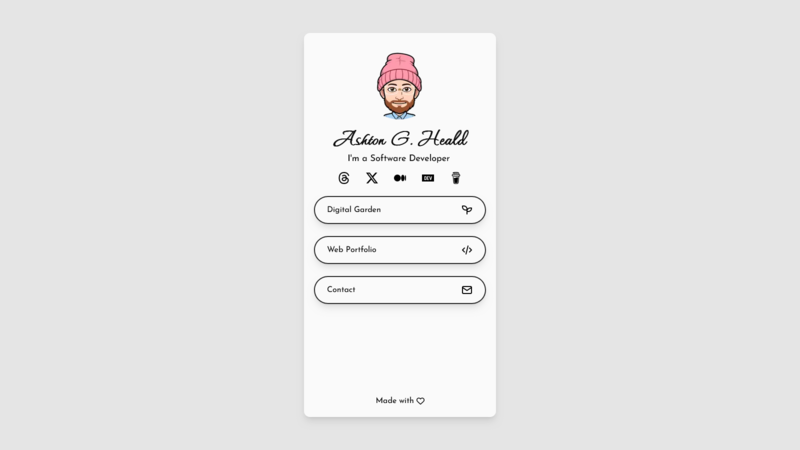

  
  <h1>Bio Links</h1>
  <h4>
    <a href="https://ashtonheald.me/">View Demo</a>
  </h4>

### Screenshots
  
|||
|:---:|:---:|

### Description
  
My personal bio link menu, designed to showcase all the essential aspects of my digital presence.

### Features

<dl>
  <dt>Typewriter Effect</dt>
  <dd>Utilizes react-type-animation library for typewriter effect</dd>
  <dt>Contact Form</dt>
  <dd>Utilizes EmailJS library for form funcitonality</dd>
</dl>

### Tech Stack

| Client | Server |
|--------|--------|
| [Astro](https://react.dev)  | [Hostinger](https://www.hostinger.com/) |
| [React](https://react.dev)  | [Namecheap](https://www.namecheap.com/) |
| [TailwindCSS](https://tailwindcss.com/) | |
| [EmailJs](https://www.emailjs.com/) | |
